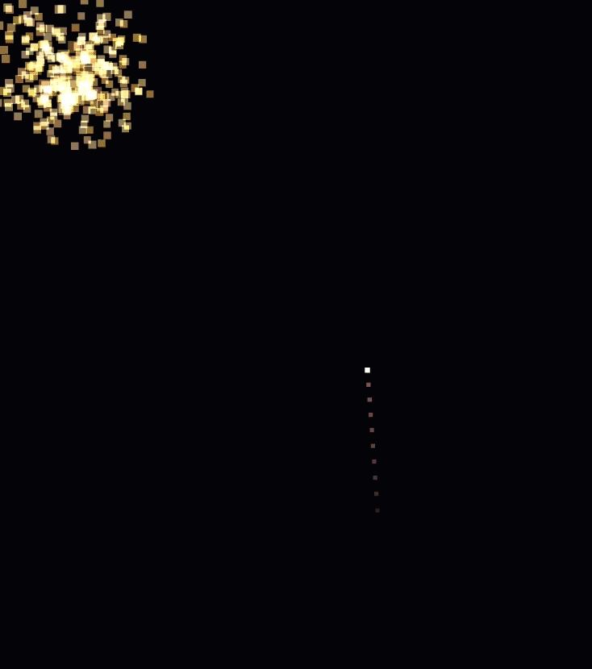

# Fireworks Overlay

Lightweight React + Three.js fireworks overlay for quiz wins, reward reveals, and confetti-style celebration moments.

<p align="center">
  
</p>

## Why This Exists

Most celebration effects are either too heavy, too intrusive, or too coupled to a full-screen landing page.

`FireworkOverlay` is built for the in-between case:

- quiz result screens that need a satisfying "correct" moment
- reward or coupon reveals that should feel premium
- confetti-like success states without blocking the rest of the UI
- live event overlays, promo pages, and festive product surfaces

## One-Line Usage

```jsx
import { FireworkOverlay } from 'fireworks-overlay'
```

## Install

```bash
npm install fireworks-overlay react three
```

## Quick Start

```jsx
import { FireworkOverlay } from 'fireworks-overlay'

export default function App() {
  return (
    <div
      style={{
        position: 'relative',
        minHeight: '100vh',
        overflow: 'hidden',
        background: '#050816',
      }}
    >
      <FireworkOverlay />

      <main
        style={{
          position: 'relative',
          zIndex: 1,
          display: 'grid',
          placeItems: 'center',
          minHeight: '100vh',
          color: '#fff',
        }}
      >
        <h1>Quiz Complete</h1>
      </main>
    </div>
  )
}
```

## Best Use Cases

### Quiz / Correct Answer

Drop it over a result card or final score view to make wins feel immediate and rewarding.

### Reward / Coupon / Badge Reveal

Use it when a user unlocks something valuable and you want a stronger "earned" moment than a basic toast.

### Confetti Alternative

Choose this when you want something more directional and premium than flat confetti, while still keeping the overlay transparent and non-interactive.

## Custom Example

```jsx
<FireworkOverlay
  spawnIntervalMs={1400}
  burstCountRange={[1, 3]}
  sparkCountRange={[176, 264]}
  coreCountRange={[48, 68]}
  sparkSpread={1.95}
  colors={['#ff6b35', '#ffd166', '#ff4d6d', '#f7b267']}
/>
```

## What You Can Tune

- `spawnIntervalMs`: delay between launch clusters
- `burstCountRange`: how many fireworks launch together
- `sparkCountRange`: outer particle count range
- `coreCountRange`: inner flash particle count range
- `sparkSpeedRange`: outer particle expansion speed
- `coreSpeedRange`: inner particle expansion speed
- `sparkSpread`: how wide the outer burst spreads
- `coreSpread`: how wide the inner flash spreads
- `colors`: firework palette
- `className`: wrapper class name
- `style`: wrapper inline style
- `zIndex`: overlay stacking order

## Notes

- The overlay is transparent and uses `pointer-events: none`, so your existing UI stays clickable.
- The package entry already exports from `src/index.js`, so the package-style import shown above is the intended usage.
- Place it inside a `position: relative` container if you want the effect scoped to a specific section.
- Regenerate the README demo asset with `powershell -ExecutionPolicy Bypass -File scripts/generate-demo-gif.ps1`.

## License

MIT
